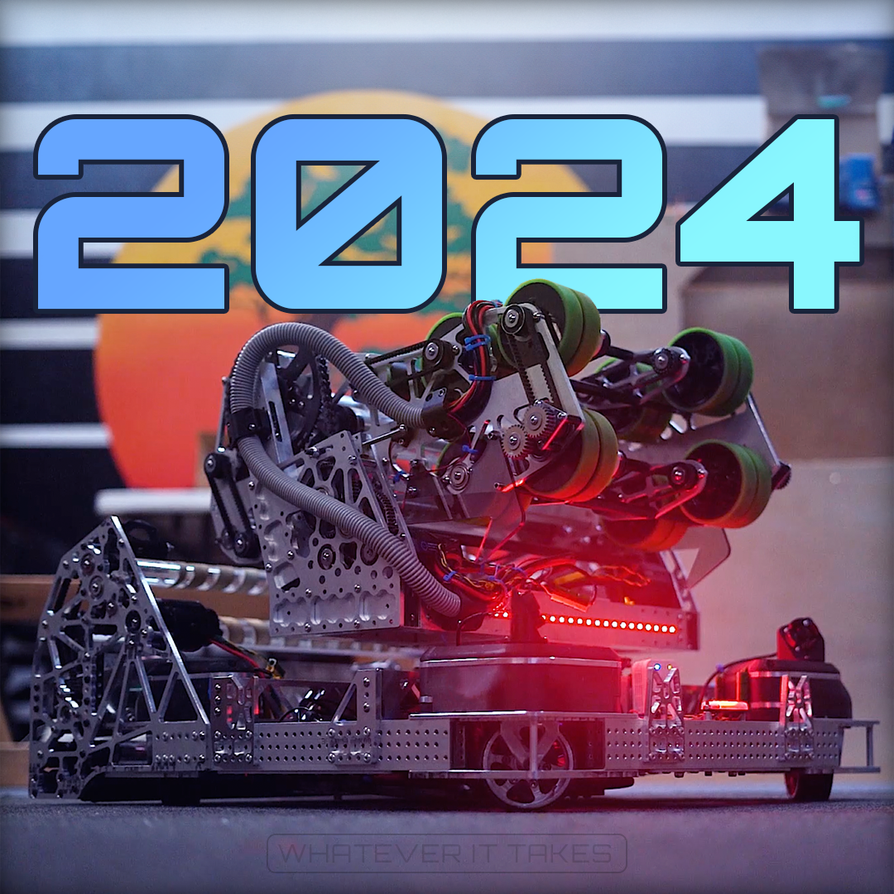

# FRC 2024 Public

This repository contains the code for FRC Team 6036's 2024 Robot: Snoopy

## Features
- [Custom autonomous trajectory optimization](./solver)
- [High-frequency vision and odometry tracking with latency compensation](./src/main/java/com/peninsula/frc2024/robot/RobotStateEstimator.java)
- [Auto-aim for speaker and ferrying](./src/main/java/com/peninsula/frc2024/subsystems/Turret.java#L100)
- [Shooting on the move](./src/main/java/com/peninsula/frc2024/robot/RobotStateEstimator.java#L112)
- [580-degree turret wrapping](./src/main/java/com/peninsula/frc2024/util/peninsulaCoolios/Turretmaxxing.java)
- [Auto alignment for amp and climb](./src/main/java/com/peninsula/frc2024/subsystems/controllers/drive/FSDController.java)
- [Note detection](./src/main/java/com/peninsula/frc2024/util/peninsulaCoolios/phronesis/fieldAwareness)
